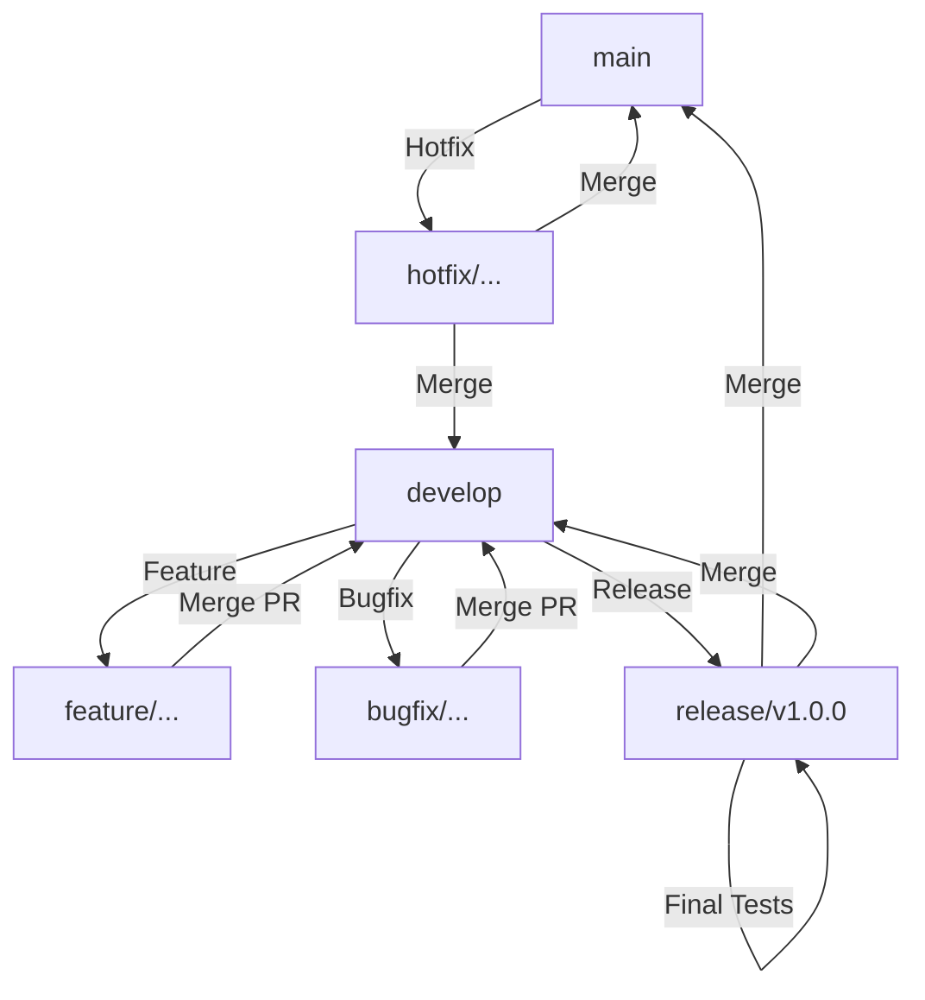

# ProConnect Git Branching Strategy

This document outlines the professional branching strategy for **ProConnect**. We follow a modified **GitFlow** approach, optimized for high-velocity SaaS development and continuous integration.

## 1. Core Branches

### `main`
- **Purpose**: Production-ready code.
- **Rules**:
  - Always stable and deployable.
  - Direct commits are strictly prohibited.
  - Changes only enter via `release/*` or `hotfix/*` branches through pull requests.

### `develop`
- **Purpose**: The main integration branch for the next release.
- **Rules**:
  - Contains the latest delivered development changes.
  - Source for all `feature/*` branches.
  - Must pass all CI tests before merging into `main`.

---

## 2. Supporting Branches

### `feature/*`
- **Source**: `develop`
- **Merge Back To**: `develop`
- **Purpose**: Used for new features or functional enhancements.
- **Naming**: `feature/<module>-<short-description>`

### `bugfix/*`
- **Source**: `develop`
- **Merge Back To**: `develop`
- **Purpose**: Used to fix bugs found during development or in the `develop` branch.
- **Naming**: `bugfix/<module>-<issue-id>`

### `hotfix/*`
- **Source**: `main`
- **Merge Back To**: `main` and `develop`
- **Purpose**: Urgent fixes for critical issues in the production environment.
- **Naming**: `hotfix/<module>-<description>`

### `release/*`
- **Source**: `develop`
- **Merge Back To**: `main` and `develop`
- **Purpose**: Preparing for a production release (final testing, versioning).
- **Naming**: `release/v<version-number>` (e.g., `release/v1.0.0`)

---

## 3. Naming Conventions

All branch names must be lowercase and use hyphens for word separation.

| Category | Prefix | Pattern |
| :--- | :--- | :--- |
| Feature | `feature/` | `feature/<module>-<description>` |
| Bugfix | `bugfix/` | `bugfix/<module>-<description>` |
| Hotfix | `hotfix/` | `hotfix/<module>-<description>` |
| Release | `release/` | `release/v<major>.<minor>.<patch>` |
| Task | `task/` | `task/<id>-<description>` |

---

## 4. Example Branches for ProConnect Modules

| Module | Example Branch Name |
| :--- | :--- |
| **Auth** | `feature/auth-jwt-implementation` |
| **Profile** | `feature/profile-resume-builder` |
| **Jobs** | `feature/jobs-advanced-filtering` |
| **Messaging** | `feature/messaging-socket-setup` |
| **Freelance** | `feature/freelance-milestone-payments` |
| **AI** | `feature/ai-job-matching-engine` |
| **Bugfix** | `bugfix/auth-token-expiration-fix` |
| **Hotfix** | `hotfix/profile-avatar-upload-fix` |

---

## 5. Workflow Flowchart

## 6. Pull Request (PR) Requirements

To maintain code quality and "sellable" standards, every PR must:
1.  **Be Reviewed**: At least one senior developer must approve the changes.
2.  **Pass CI**: GitHub Actions (Lint, Build, Test) must succeed.
3.  **Linked Issues**: Reference the relevant task or requirement ID in the description.
4.  **No Conflicts**: Branches must be rebased with `develop` before merging.

---
**Standardized by**: ITX Digital Services (PVT) LTD
**Revision**: 1.0.0
